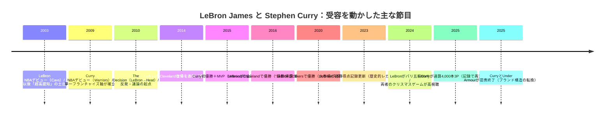

# LeBron James と Stephen Curryの米国内受容比較レポート

## Executive Summary

LeBron James と Stephen Curry は、ともにentity["sports_league","NBA","us basketball league"]の「全米規模の顔」だが、受容の“質”が異なる。定量的には、一般層における認知（Fame）はLeBronが圧倒的に高い一方で、好感の純度（Disliked byの低さ）はCurryが優位である。entity["company","YouGov","public opinion polling"]の公開データでは、LeBronのFameは90%で、Curryは72%。Popularity（好意的割合）は両者46%で同水準だが、Disliked byはLeBron 19%に対しCurry 7%で、Curryの方が「嫌われにくいスター」という色が強い。citeturn2view0turn34search2

注目（視聴・デジタル）の面では、NBA公式集計（2024-25レギュラーシーズンのSNS/デジタル視聴）でLeBronが3.23B views、Curryが2.56B viewsと、LeBronが最大級の“集客装置”であることが示される。citeturn11view0 ただし、同じシーズンのジャージ売上（NBAStore.com）ではCurryが2位、LeBronが3位で、コアファンの購買熱量はCurryがわずかに上回る局面がある。citeturn11view0

議論・賛否分裂を生む要因は、LeBronの方が明確である。大移籍（2010年の「The Decision」）が強い反発と象徴的な抗議（ジャージ焼き）を誘発したこと、さらに政治・国際問題に絡む発言が論争化しやすいことが、長期的に「高認知×高分極」を作っている。citeturn19search5turn33search0turn19search3 一方Curryの論争は相対的に小粒で、住宅問題（Athertonの開発反対）や月面着陸発言などの局所的炎上はあるが、全体の“嫌われにくさ”は保たれている。citeturn34search7turn34news38turn34search2

地域性では、LeBronはentity["city","Akron","Ohio, US"]との結びつきを慈善・教育投資で制度化しつつ（I PROMISE School等）、移籍によってentity["sports_team","Cleveland Cavaliers","nba team"]→entity["sports_team","Miami Heat","nba team"]→entity["sports_team","Los Angeles Lakers","nba team"]と“複数都市の物語”を背負う。citeturn18search2turn18search0 Curryはentity["sports_team","Golden State Warriors","nba team"]の単一フランチャイズ象徴としての一貫性が強く、entity["city","Oakland","CA, US"]中心の慈善活動（Eat. Learn. Play.）が地域ブランドを補強する。citeturn18search1turn28view0

## 認知・好感と視聴注目の定量比較

「一般層（US adults）」と「NBAファン層」で分けて見ると、両者の受容は次のように整理できる。まず一般層では、YouGovの定義上、Fameは「知っている割合」、Popularityは「好意的割合」であり、同じPopularityでもDisliked by（嫌悪の割合）が違うと“好意の純度”が変わる。citeturn2view0turn34search2

次にファン層に寄せると、YouGovのNBAファン報告（2024年1月のProfiles集計、複数選択）で「好きなNBA選手」はCurry 27%、LeBron 25%で、Curryが僅差で上回る。citeturn5view0 これは「一般層の好意（46%で同率）」とは別に、ファンの“推し”としての強度がCurry側に寄りやすいことを示唆する。

デジタル注目は、NBA公式（NBA Communications）が2024-25のSNS/デジタル視聴を集計しており、最も視聴された選手はLeBron（3.23B views）、次いでCurry（2.56B views）と明示される。citeturn11view0 ここで重要なのは、両者が単に「人気」なだけでなく、リーグ全体の配信・SNS経済圏を牽引する“トップ・オブ・トップのトラフィック源”になっている点である。citeturn11view0

テレビ視聴（マス視聴）でも、2024年クリスマスのLakers対Warriorsは平均7.76M視聴（ピーク8.32M）で「5年で最も見られたNBAレギュラーシーズン/クリスマスゲーム」とされ、両者の“同時出演”が視聴を押し上げる構図が確認できる。citeturn12view0

### 比較表

| 指標 | LeBron | Curry | 補足（定義/範囲） | 出典URL |
|---|---:|---:|---|---|
| YouGov Fame | 90% citeturn2view0 | 72% citeturn34search2 | US adultsで「聞いたことがある」割合 | `https://today.yougov.com/topics/sport/explore/sports_personality/LeBron_James` / `https://today.yougov.com/topics/_/explore/_/Stephen_Curry` |
| YouGov Popularity | 46% citeturn2view0 | 46% citeturn34search2 | US adultsで「好意的」割合 | 同上 |
| YouGov Disliked by | 19% citeturn2view0 | 7% citeturn34search2 | US adultsで「嫌悪」割合 | 同上 |
| NBAファンの「好きな選手」 | 25% citeturn5view0 | 27% citeturn5view0 | NBA fans 18+、複数選択（YouGov Profiles, Jan 2024） | `https://commercial.yougov.com/rs/464-VHH-988/images/WP-2024-02-US-NBA-Fan-Report.pdf` |
| NBA SNS/デジタル視聴（2024-25 RS） | 3.23B views citeturn11view0 | 2.56B views citeturn11view0 | NBA公式の「most-viewed players on NBA social & digital platforms」 | `https://pr.nba.com/2024-25-season-social-media-merchandise/` |
| ジャージ売上順位（2024-25 RS） | 3位 citeturn11view0 | 2位 citeturn11view0 | NBAStore.com売上（公式発表） | 同上 |
| クリスマスゲーム視聴（2024/12/25） | 7.76M平均・8.32Mピーク citeturn12view0 | 同左（同一試合） citeturn12view0 | Lakers vs Warriors（両者の“対戦カード”の引力） | `https://pr.nba.com/nba-christmas-day-2024-viewership/` |
| 年間推定収入（Forbes 2025） | $133.8M citeturn13view1 | $156M citeturn13view1 | entity["company","Reuters","news agency"]がForbesランキングを要約（推定、on/off含む） | `https://www.reuters.com/sports/ronaldo-tops-forbes-list-highest-paid-athletes-third-year-row-2025-05-15/` |
| SpringHillの企業価値（資金調達局面） | $725M valuation citeturn32view0 | 不明 | 少数株主持分の売却での評価額（Axios報道） | `https://www.axios.com/2021/10/14/lebron-springhill-epic-nike-fenway-redbird` |
| Eat. Learn. Play.の累計投資 | 不明 | $90M超 citeturn28view0 | 公式サイトのImpact記載（累計） | `https://www.eatlearnplay.org/` |
| I PROMISE School開校 | 2018年7月 citeturn18search2 | 不明 | LJFF×Akron Public Schoolsで開校 | `https://www.lebronjamesfamilyfoundation.org/i-promise-school/` |
| Under Armourの「Curry分離」局面での開示 | 不明 | UA FY2026バスケ収益見通し $100–$120M（Curry Brand含む） citeturn15search3 | 企業ガイダンス（Curry本人の収入ではない） | `https://www.reuters.com/business/under-armour-expands-restructuring-effort-plans-separate-curry-business-2025-11-13/` |

## 商業インパクトとブランド構造

ジャージ売上とチームマーチャンダイズは、リーグの「どの選手が購買行動を動かすか」を測る実務指標である。2024-25のNBA公式発表では、ジャージ売上はCurryが2位、LeBronが3位で、両者とも“常時上位”の商業エンジンである。citeturn11view0 同じ発表で、チームマーチャンダイズはLakersが1位、Warriorsが3位となっており、両選手が所属するフランチャイズ自体が「全米の購買対象」になっている。citeturn11view0

推定年収（スポンサー・事業を含む総収入）では、Reutersが引用するForbes 2025ランキングでCurryが$156M、LeBronが$133.8Mと報じられている。citeturn13view1 ここで注意点は、これが「推定」であり、個別スポンサー契約の金額公開とは別物である点だ（本レポートでは、未公開の契約金額は不明とする）。citeturn13view1

スポンサー・シューズ契約については、LeBronはentity["company","Nike","sportswear company"]と“生涯契約”を結んだとentity["company","ESPN","sports media network"]が報道し、金額は非公開だが「同社史上最大級の単一アスリート保証」とされる。citeturn15search16 Curry側はentity["company","Under Armour","sportswear company"]との長期契約延長（引退後も続く可能性を含む）をESPNが伝えていたが、2025年に両者が提携終了し、Curry Brandが独立運営へ移る局面がReutersで報じられた。citeturn15search11turn15search3 この離脱は、Curry個人への好感度というより、ブランド運用・収益構造が“第二章”に入ったことを意味する（UA側はバスケ事業売上見通しを開示しつつ、連結業績への影響は限定的と述べる）。citeturn15search3

LeBronの商業構造で特筆すべきは、選手個人を越えた“製作・広告・IP”の垂直統合である。The SpringHill Companyは投資家グループへの少数株式売却で$725M評価を得ており、投資家にNikeやFenway Sports Group、Epic Games等が含まれる（Axios）。citeturn32view0 これは「スポンサー＝広告塔」だけではなく、「スポンサー＝資本参加・共同事業者」へ寄せたモデルで、LeBronの受容が“スポーツ・エンタメ合同の巨大ブランド”として形成されてきたことを示す。citeturn32view0

## メディア化と映像作品

両者ともメディア露出は多いが、受容形成に効く“物語の置き方”が異なる。LeBronは「移籍・勝利・反発・帰還」といったストーリーの山場が多く、その都度メディア化（特番・映画・シリーズ）が起きやすい。Curryは「プレー様式の革新と“好かれやすさ”」を背景に、家族向け・信条（faith）・スポーツを軸にした制作会社のアウトプットが体系化されている。citeturn35view1turn30search0

image_group{"layout":"carousel","aspect_ratio":"16:9","query":["Space Jam: A New Legacy poster","The Shop: Uninterrupted HBO key art","Stephen Curry: Underrated poster Apple TV+","GOAT 2026 animated film poster"],"num_per_query":1}

### メディア作品一覧

| タイトル | 年 | 形式 | LeBronの関与度 | Curryの関与度 | 出典URL |
|---|---:|---|---|---|---|
| entity["tv_show","The Decision","espn special 2010"] | 2010 | TV特番 | 本人が移籍先を発表（物語の分岐点） citeturn19search5turn19search2 | — | `https://www.espn.com/nba/story/_/id/29385150/nba-debate-legacy-lebron-decision` |
| entity["movie","More than a Game","documentary 2008"] | 2008 | ドキュメンタリー映画 | 出演（高校時代の物語） citeturn29search0 | — | `https://en.wikipedia.org/wiki/More_than_a_Game` |
| entity["movie","Space Jam: A New Legacy","2021 film"] | 2021 | 劇場映画 | 主演＋制作会社関与（The SpringHill Company Production） citeturn29search6 | — | `https://www.spacejam.com/` |
| entity["movie","Shooting Stars","biographical film 2023"] | 2023 | 伝記映画（配信） | 製作（producerとして明示） citeturn29search17turn29search13 | — | `https://www.tvinsider.com/1088003/shooting-stars-lebron-james-first-look/` |
| entity["tv_show","The Shop: Uninterrupted","talk show 2018"] | 2018– | トークシリーズ | 共同製作・出演（EPとしてクレジット） citeturn29search7turn29search11 | — | `https://press.wbd.com/us/media-release/hbo-0/hbo-sports-and-uninterrupted-present-all-new-edition-shop-uninterrupted-debuting-may` |
| entity["movie","Stephen Curry: Underrated","documentary film 2023"] | 2023 | ドキュメンタリー映画 | — | 出演＋Unanimousの既発作品として言及 citeturn1search21turn30search26 | `https://www.apple.com/tv-pr/news/2023/05/apple-original-films-announces-stephen-curry-underrated/` |
| entity["movie","GOAT","animated film 2026"] | 2026 | アニメ映画 | — | 声優＋プロデューサー citeturn30news42turn30news40 | `https://people.com/stephen-curry-underdog-journey-made-goat-movie-personal-exclusive-11903253` |
| entity["movie","The Queen of Basketball","doc short 2021"] | 2021 | 短編ドキュメンタリー | — | エグゼクティブ・プロデューサー（UnanimousのWork欄） citeturn30search0 | `https://unanimousmedia.com/pages/our-work` |
| entity["tv_show","Holey Moley","abc series 2019"] | 2019 | TV番組 | — | エグゼクティブ・プロデューサー（UnanimousのWork欄） citeturn30search0turn30search1 | `https://unanimousmedia.com/pages/holey-moley` |

※関与度は「出演／製作（EP/Producer）／制作会社としての関与」を基準に記載。公式に明示されない金額・契約条件は不明とした。citeturn29search6turn30search0

## 重要イベントと受容の転換点

両者の受容を「人気・注目・議論・地域性」に分解すると、キャリアの節目が“受容の型”を切り替えるトリガーとして働いている。

LeBronの代表例は2010年の「The Decision」で、移籍そのもの以上に「発表の形式」が炎上・反発を増幅し、Clevelandではジャージ焼きが象徴的に報じられた。citeturn19search5turn33search0 その後、2014年のCavs復帰表明では「記者会見やパーティーはしない」と明言し、前回の反省点を踏まえた“物語の語り直し”を行っている（Sports Illustrated掲載文をSIが引用）。citeturn33search2

Curryは、単一フランチャイズでの成功の積み上げが基本線で、2015–2016のMVP、複数回の優勝、そして2025年の通算4,000本3P到達などの記録イベントが「プレーの革新者」という受容を強化している。citeturn18search1turn21search8

上の節目の事実関係は、NBA公式の選手バイオ（優勝・MVP等）、NBA公式ニュース（得点記録・4,000本3P・五輪MVP）、NBA Communications（クリスマス視聴）、Reuters（Under Armour離脱）に基づく。citeturn18search0turn18search1turn21search0turn21search8turn21search2turn12view0turn15search3

## オフコート活動と賛否分裂要因

米国内受容を実務的に理解するうえで、「NBAファンはオフコート要素をどれだけ重視するか」が前提になる。YouGovのNBAファン報告では、NBAファンは一般層より社会・政治課題と自己同一化しやすい（“18% more likely”）と示され、月1回以上ボランティアするNBAファンは27%とされる。citeturn27view0 つまり、選手の社会的発言・慈善・ビジネスは、NBAファン基盤の中で無視できない受容要素になっている。citeturn27view0

LeBronはこの領域で、教育・地域投資を制度化している。公式によれば、LeBron James Family FoundationがAkron Public Schoolsと協働し、2018年7月にI PROMISE Schoolを開校した。citeturn18search2 さらにI PROMISE Programは2011年開始で、現在は多数の生徒を支援する枠組みだと説明されている。citeturn18search9 こうした活動は「地域主導」の好感と結びつく一方、LeBronは政治・国際問題の文脈でも注目されやすく、たとえば2019年の中国・香港を巡るやり取りで批判が起きたことがWashington Postで論評・報道されている。citeturn19search3turn19search0

Curryは、慈善がより“学校体験の改善”に寄っている。Eat. Learn. Play.公式のImpactでは、2019年設立後、累計で$90M超を投資し、25 million mealsの提供、学校施設（校庭・ジム・食堂・図書館）の改修などを行ったと明記される。citeturn28view0 この「教育×食×運動」のパッケージは地域（Oakland Unified School District）と強く接続し、地域主導型のブランド形成と相性が良い。citeturn28view0

賛否分裂の“根”は、LeBronの方が深い。2010年のThe Decisionをめぐっては、発表直後にClevelandでジャージが燃やされたとAPが回顧している。citeturn33search0 その後LeBronは復帰表明で語り直しを行うが、こうした「大きな物語の分岐点」が何度も起きる選手は、好意と反感の両方が蓄積しやすい（YouGovのDisliked byが19%であることは、その蓄積が現在も残る状況と整合する）。citeturn2view0

Curryにも論争はあるが、構造的には限定的である。例として、Athertonの住宅計画を巡る書簡が地域メディアで報じられた件や、月面着陸発言が大きく扱われ、その後NASA訪問に至った件などがある。citeturn34search7turn34news38 ただ、これらは“人格全体の賛否二分”というより、個別テーマでの短期炎上として扱われやすく、YouGovのDisliked byが7%に留まる現状と整合的である。citeturn34search2

## 世代・地域性の差と結論

世代差を直接「LeBron支持は何歳が何%」の形で比較する公開データは限定的だが、ファン行動の一般特性から、受容のレバーは推定できる。YouGovの調査では、NBAに興味を持つ理由として「選手が好き」が男女とも最大要因（男性38%、女性30%）で、「地元にチームがある」（男性34%、女性20%）も強い。citeturn26view0 これは、スター個人（LeBron/Curry）と地域フランチャイズ（Lakers/Warriors）の両輪で受容が形成されることを意味する。citeturn26view0

さらに、NBAファンの視聴強度を見ると「地元/推しチームの試合をほぼ毎回 or 多く見る」層が35%おり、超熱量層は男性68%、年齢は25–34が26%、35–44が23%など“中核は25–44”に偏る。citeturn26view1 この分布に照らすと、2010年代にリーグの中心を担ったLeBronとCurryが、現在もコア層の記憶資産（ハイライト・優勝体験）として機能し、NBA公式のデジタル視聴上位を維持していることは合理的である。citeturn26view1turn11view0

地域性については、YouGovのNBAファン調査で「好きなチーム」がLakers 22%、Warriors 16%と全国的支持が確認されるため、両者の地域性は“ローカル限定”ではない。citeturn5view1 ただし質的には、LeBronはキャリア上の移動（Cleveland→Miami→Los Angeles）とAkronでの教育投資によって「複数地域に根を張るスター」であり、地域支持と反発が周期的に発生しうる。citeturn18search0turn18search2turn33search0 Curryは単一フランチャイズの象徴性とOakland中心の慈善活動で「地域アイコン＋全国的好感」を作りやすい構造にある。citeturn18search1turn28view0turn34search2

結論として、受容タイプを提示すると次のように整理できる。LeBronは「注目主導×議論主導」が強い（デジタル視聴最大級、かつ反発を伴う節目が多い）。citeturn11view0turn33search0turn2view0 Curryは「好感主導×地域主導」が強い（嫌悪率が低く、ファン内での“推し”比率が高い）。citeturn34search2turn5view0turn28view0  
マーケティング/ファン理解への示唆は明快で、LeBronは“議論を伴う巨大リーチ”を前提に語りの設計（誤解を招く煽り方のコストを含む）が重要になり、Curryは“嫌われにくい信頼”を土台に家族向け・地域向け・長期IP展開を積み上げるのが合理的である。citeturn2view0turn34search2turn30search0turn32view0