# Dean Oliver『Basketball on Paper』（2004）の章別命題と後続研究マップ

## Executive Summary
本書は、バスケットボールを「ポゼッション（攻防の機会数）」と効率で捉える枠組みを軸に、Four Factorsや個人成績（ORtg/DRtg等）の計算法・解釈を体系化した実務的古典である。NBA公式統計UIにもFour Factorsが埋め込まれ、学術側では基礎概念を査読論文に移植したJQAS 2007を起点に、因果妥当化・多変量化・他リーグへの移植が進んだ。本報告は章題（版差あり）と入手可能な一次/二次情報を突合し、章ごとの主要命題→後続研究（後続/拡張/反例/方法論補完）→ユーザーPDF群の照合表、を「読解マップ」として提示する。

## 調査設計とアクセス制約
本調査の目的は「章→主要命題→後続研究→ユーザー所持論文」の対応づけにより、後から任意の論文を追加投入しても拡張可能な“索引（インデックス）”を作ることにある。

章立ては、書誌サイトの目次情報（章題・開始ページ）を一次情報として採用し、ページ番号は版差を前提に「章題＋命題」で同定する。
Four Factorsの定義・計算式は、実務側の一次ソースとしてNBA公式のStats Help（FAQ/Glossary）を優先し、一般的普及形はBasketball-Reference.comの説明と突合した。
学術的な「査読上の起点」としては、Oliver本由来の概念群を“共通語彙”として整理し直したJQAS 2007（査読）を最上位ハブとして扱う。

アクセス制約（重要）として、Journal of Sport Management掲載のAlamar（2006）書評は、書誌情報ページは確認できる一方で本文（全文）は取得できず、検索スニペット以上の一次引用ができない。したがって本書評の「褒め/問題視」の再構成は、(a) 書誌メタデータ、(b) 取得できた断片（スニペット）、(c) 二次要約（ブログ等）を明確に区別し、断片依存箇所を注記した。

## 学術的・実務的立ち位置
本書の中核は、「試合は両者がほぼ同数のポゼッションを持つ」「よって“点/試合”ではなく“点/ポゼッション（効率）”で比較すべき」という見取り図を、チーム評価・個人評価・将来予測へ展開する点にある。これを学術側に移植したのがJQAS 2007で、同論文は“非学術・非伝統的査読”から発展してきた基本概念を査読論文として共通化することを目的に掲げ、ポゼッション推定、ORtg/DRtg、Four Factors、plus/minus、Pythagorean、Bell Curve等を「ポゼッション枠組みに入る道具立て」として列挙している。

実務側の強い根拠として、NBAのStats Helpは、Four Factorsが「勝つチームが優れる4指標」として、eFG%、TO Ratio、OREB%、FTA Rateを明示し、eFG%の定義式なども掲載している。 さらにStats UIでは、チーム/ラインナップ/クラッチなど複数のFour Factorsダッシュボードが提供されており、概念が“分析用語”から“運用UI”へ移植されたことが確認できる。
一方で学術側では、Four Factorsを多変量モデルで再解釈する流れ（例：SEMで潜在変数“攻撃/守備クオリティ”として扱う）があり、Four Factorsを単純な線形回帰の寄与率として固定視する立場を相対化している。Tarek Baghal（2012, 査読）は、Four Factorsの多変量解析にSEMを適用すること自体を主要貢献として位置づける。 またAlessandro Cecchin（2022, 査読）は「因果推論の近年の発展」を踏まえて、Four Factorsモデルを因果的に妥当化することを目的に掲げている。

実務的には、Basketball-Reference.comが「Four Factors of Basketball Success」として、Shooting/Turnovers/Rebounding/Free Throwsおよび重み（40/25/20/15）を明示しており、一般公開の統計文脈での定着が確認できる。

### Alamar（2006）書評の論点再構成（アクセス可能範囲）
確認できた一次情報は、(i) 書評がJournal of Sport Management 20(1)に掲載され、ページ120–123であること、(ii) DOI、(iii) “Restricted access”表示、(iv) 検索結果として冒頭断片「One of the principal lessons…」が存在すること、である。

この範囲から“断片に基づき確実に言える”論点を、過剰推論を避けて整理すると以下になる。

第一に、書評の導入（少なくとも冒頭）は「成功するスポーツチームから得られる主要な教訓（principal lessons）」という一般化から始まっており、本書を単なる計算法集ではなく“チーム成功の一般原理”として読む枠を提示していることが示唆される（ただし全文確認不能のため、書評全体の主張として断定はできない）。

第二に、全文が確認できないため「具体的に何を褒め、何を問題視したか」を章・概念単位で完全復元することは不可能である。現時点で可能な厳密な代替は、(a) 書評本文にアクセス可能な環境（大学図書館契約等）で該当4ページの主張文を抽出する、または (b) 書評を引用・要約している二次資料が存在するなら、その“引用箇所”だけを根拠として再構成する、のどちらかになる。書評自体の書誌実在性は確認できているため、後段の章別マップでは「Alamar（2006）は“査読/編集済みの読者評価”として存在する」こと自体を位置づけ要素として扱い、内容評価には踏み込まない（断片以上は根拠不足）。

## 章別主要命題と後続研究カタログ
以下では、(A) 後続研究（査読優先）を「カタログ化」し、(B) 章→命題→カタログIDへリンクする。章命題のうち、書誌目次からは確実に分かるのは“章の主題（タイトル）”までであり、章内の個別主張は (i) 査読論文が再掲した定義（例：ポゼッション推定）や、(ii) 実務UIに実装された定義、(iii) 二次要約（章紹介記事）に基づく場合がある。依拠先を「根拠欄」で明記する。

### 後続研究・実務資料カタログ
| ID | 文献（最低限の書誌） | 年 | 査読 | 要旨（1–2行） | Oliver本との関係性 |
|---|---:|---|---|---|---|
| R1 | “A Starting Point for Analyzing Basketball Statistics”（Justin Kubatkoほか） | 2007 | あり | ポゼッション概念を中心に、ポゼッション推定式の一般化・推定を提示し、ORtg/DRtg、Four Factors等の基本語彙を査読論文として整理。 | 「本の道具立て」を査読へ移植（方法論的補完・後続） |
| R2 | “Are the ‘Four Factors’ Indicators of One Factor?”（Tarek Baghal） | 2012 | あり | Four Factorsを多変量で扱うためSEMを適用し、勝率説明を潜在変数（攻撃/守備クオリティ）として再構成する方向性を示す。 | Four Factorsの“線形寄与”解釈を拡張（拡張・方法論補完） |
| R3 | “Oliver’s four-factor model: Validation through causality”（Alessandro Cecchin） | 2022 | あり | Four Factorsモデルの妥当性を、因果推論の枠組み（構造方程式モデル等）で検証する目的を明示。 | Four Factorsを“因果”として位置づけ直す（拡張・批判的補完） |
| R4 | “Estimating team possessions in high-level European basketball competition”（Evangelos Charamisほか） | 2023 | あり | Euroleagueデータでチームポゼッション推定を扱い、NBA由来の推定枠組み（Kubatko et al. 2007）を実装・比較。 | 「ポゼッション推定」の外部妥当性（他リーグ）検証（拡張） |
| R5 | “Modeling Player and Team Performance in Basketball”（Zachary Terner, Alexander Franks） | 2020–2021 | あり（Annual Review） | チーム戦略の特徴付けと個人評価（価値/守備/ショット等）をレビューし、今後の課題として因果推論の必要性を述べる。 | 2004本の“道具立て”の後継レビュー（後続・俯瞰整理） |
| R6 | “Modeling offensive player movement in professional basketball”（Steven Wu, Luke Bornn） | 2017 | なし（Preprint） | SportVU追跡データからオフェンス移動を可視化・モデリングする手順をガイド化。 | “ボックススコア以後”の拡張データで個人/戦術を扱う（拡張） |
| R7 | “Player archetypes within basketball: optimizing roster composition…”（Luke S. J. Penner） | 2025 | あり | 多リーグ・ボックススコア統計を標準化しk-meansで9類型へクラスタリング、ロスター構成最適化を議論。 | 本の「役割/相互作用/選手類型」思想の機械学習的展開（拡張） |
| R8 | “A review on the basketball jump shot”（Victor H. A. Okazakiほか） | 2015 | あり | ジャンプシュートのバイオメカニクス研究をレビューし、距離・姿勢・協調等の論点を整理。 | 本が扱う“効率（eFG等）”の微視的原因を補完（方法論的補完） |
| R9 | “The Jump Shot Performance in Youth Basketball: A Systematic Review”（Cíntia Françaほか） | 2021 | あり | ユースのジャンプシュート成績に影響する要因（距離、疲労、防守者、視覚情報等）を系統的に整理。 | “シュート効率”を訓練・状況要因へ分解（補完） |
| R10 | “Biomechanical analysis of the jump shot in basketball”（Artur Struzikほか） | 2014 | あり | ジャンプシュートとCMJの下肢力学的差異を比較する目的を明示。 | “得点効率”の運動学的制約を補完（補完） |
| R11 | “Biomechanics of the Basketball Jump Shot—Six Key Teaching Points”（Duane Knudson） | 1993 | あり（教育系雑誌） | シュートのバイオメカ研究から指導上の6ポイントを提示する趣旨の抄録が確認できる。 | 本の“実務ツール”志向と同型（実務応用・補完） |
| R12 | “Origins and current issues in Quiet Eye research”（Joan N. Vickers） | 2016 | あり（OA） | Quiet Eye研究の起源と争点を整理するターゲット論文。 | 本の“観察→指標化”の前提（認知・視覚側の補完） |
| R13 | “The Role of Quiet Eye Timing and Location in the Basketball Three-Point Shot…”（Vickersほか） | 2019 | あり（OA） | 3Pシュートでの注視タイミング/位置/ディフェンス影響という不確実性3点を実験で検討。 | “シュート効率”の知覚・注意的原因を補完（補完） |
| R14 | “Research of visual attention in basketball shooting: A systematic review with meta-analysis”（Matic Sirnikほか） | 2022 | あり | 視覚的注意・Quiet Eyeとシュート成績の関係を系統的レビュー＋メタ分析で統合。 | 本の“結果指標”を視覚制御に分解（補完） |
| R15 | “A Review of Basketball Shooting Analysis Based on Artificial Intelligence”（W. Yanほか） | 2023 | あり | AIによるシュート分析を4領域に系統化し、データ収集〜評価指標まで方法論を整理。 | 本が前提とする“ボックススコア以後”の計測・推定の拡張（拡張） |
| R16 | “Modelling and Simulation in Game Performances… in the NBA”（Shaoliang Zhang, Universidad Politécnica de Madrid） | 2019 | 学位論文 | ゲーム関連統計で選手・チームのパフォーマンスをモデル化/シミュレーションする目的を明示。 | 本の“チーム/個人評価→予測”を研究計画として拡張（拡張） |
| R17 | “A comprehensive review of plus-minus ratings…”（Lars Magnus Hvattum） | 2019 | あり（OA） | プラスマイナス系のモデル群を包括レビューし、文献断片化など課題も指摘。 | 本の「個人の勝敗寄与」問題の後継理論（後続・限界整理） |
| R18 | “Improved NBA Adjusted +/- Using Regularization…”（Joseph Sill） | 2010 | 会議（MIT Sloan） | APM/RAPMの推定・評価枠組み（正則化、外部検証）を提示する趣旨。 | 本の“個人評価の聖杯”系テーマの統計的拡張（拡張） |
| R19 | “The hot hand in basketball…”（Thomas Gilovich, Robert Vallone, Amos Tversky） | 1985 | あり | 連続成功（hot hand）信念とショット系列の独立性を検討し、76ersデータ等で正の相関証拠がないと報告。 | 本の「連勝/勢い」解釈（章4）と親和（反例・認知バイアス補完） |
| R20 | “Surprised by the Hot Hand Fallacy?…”（Joshua B. Miller, Adam Sanjurjo） | 2018–2024 | あり | 連続系列での統計的バイアスを示し、古典的結論が反転しうることを論じる（後年版で議論継続）。 | 「勢い」議論の方法論的反例（反例・方法論補完） |
| R21 | “Racial Discrimination Among NBA Referees”（Joseph Price, Justin Wolfers） | 2010 | あり | 逆人種クルーによる反則増などを報告する趣旨が抄録で確認できる。 | “審判/外乱”の定量化（章12）に対応（拡張・補完） |
| R22 | “The Problem of Shot Selection in Basketball”（B. Skinner） | 2012 | あり | ショットクロック残り機会数に依存する最適シュート閾値を理論化し、NBAデータと比較。 | 本の「スコアラー問題/効率」章（19等）の理論補完（補完・限界提示） |
| R23 | NBA Stats Help（FAQ/Glossary） | — | 実務一次 | Four FactorsをeFG%、TO Ratio、OREB%、FTA Rateとして定義し、式も提示。 | 実務での定義確定（実務応用の根拠） |
| R24 | Basketball-Reference.com “Four Factors”解説 | — | 実務一次 | Four Factorsと重み（40/25/20/15）を明示し、一般公開の参照点になっている。 | 普及形の定着（実務応用の根拠） |
| R25 | 章目次（Barnes & Noble） | — | 書誌一次 | 章題・開始ページを提供。 | 本報告の章同定の基礎（一次） |
| R26 | “Basketball on Paper: How It Works / Finishing…”（Coach’s Climb） | 2020 | 二次 | 章1–2・終盤の要点（「統計は観察の補完」等）を引用付きで要約。 | 章命題の補助（ただし査読ではない） |
| R27 | “Watching a Game: Offensive Score Sheets | Basketball on Paper Ch2”（Medium） | 2022 | 二次 | 章2をスコアシート→ポゼッション→ORtg/DRtgへ接続して要約。 | 章2の二次要約（補助） |

### 章別の主要命題（章→命題→後続研究）
表中の命題は「その章が何を“主に言うために存在するか”」へ収束させている。特に章13–17・23–24は、後続の査読文献（R1等）と実務UI（R23）により、概念定義が外部同定しやすい。一方、章7・21・22のようなケーススタディ章は、章題と出版社説明から「指標適用の実例集」として位置づけ、学術的後続は“方法”より“応用”側へ寄せて紐づける。

| 章 | 章題（開始ページ） | 主要命題（この報告の再構成） | 根拠（一次/二次/査読） | 対応する後続研究（関係タグ） |
|---|---|---|---|---|
| 1 | How to Read This Book（1） | 「戦術本ではなく、観察と統計を“コーチングの補助輪”として使う」ための読み方・問いの設定。 | R25, R26 | R5（後続レビュー）, R26（要約） |
| 2 | Watching a Game: Offensive Score Sheets（8） | スコアシート→ポゼッション概念→効率（PPP/ORtg/DRtg）へ接続してゲームを再記述する。 | R25, R27, R1 | R1（方法論補完）, R4（拡張：他リーグ）, R27（要約） |
| 3 | The Best Offenses and Defenses…（29） | チームの強さを“得点総数”でなく“攻守効率”で比較・歴史比較する。 | R25, R1 | R1（後続）, R5（レビュー） |
| 4 | We Won Three in a Row!（69） | 連勝・勢いの解釈（小標本・偶然）を統計的に扱う問題設定。 | R25（章題） | R19（反例/古典）, R20（方法論的反例） |
| 5 | Teamwork（77） | 個の足し算ではない“相互作用としてのチーム力”を概念化する。 | R25, 出版社説明 | R7（拡張：アーキタイプ/構成）, R5（レビュー） |
| 6 | Rebounding Myths and Roles（86） | リバウンドを役割・状況・価値で再解釈し、神話（過大/過小評価）を検討する。 | R25 | R23（実務：Four FactorsにOREB%）, R24（普及形） |
| 7 | Derrick Coleman’s Insignificance（93） | ケーススタディで「目立つ数字」と「勝利寄与」のズレを扱う。 | R25 | R17（後続：個人寄与推定のレビュー）, R18（拡張：RAPM系） |
| 8 | Amos Tversky’s Basketball Legacy（101） | 認知バイアス/不確実性の観点から、統計解釈の落とし穴を扱う（章題から）。 | R25 | R19（hot hand）, R20（反例） |
| 9 | The Power of Parity（108） | リーグの均衡（パリティ）を成績分布・予測可能性として捉える。 | R25 | R16（拡張：リーグ/チーム統計でシミュレーション）, R5（レビュー：予測文脈） |
| 10 | Teamwork 2: A Game of Ultimatums（114） | チーム内協力をゲーム理論的・インセンティブ設計として扱う。 | R25 | R7（拡張：構成最適化）, R5（レビュー） |
| 11 | Basketball’s Bell Curve（117） | チーム/選手の能力分布、予測、回帰等を“分布”として扱う（章題）。 | R25, R1（Bell Curve method言及） | R1（方法論補完）, R5（レビュー） |
| 12 | Bad Referees…（134） | 審判など外生要因が結果に与える影響（ノイズ/バイアス）を扱う。 | R25 | R21（拡張：審判バイアスの実証）, R5（レビュー） |
| 13 | Teamwork 3: Distributing Credit…（144） | 協力ゲームでの“貢献配分（クレジット割当）”を統計指標で実装する。 | R25 | R17（後続：個人寄与モデルの整理）, R18（拡張） |
| 14 | Individual Floor Percentages and Offensive Ratings（154） | 個人オフェンス効率（ORtg等）と“フロア%”の計算法・解釈を与える。 | R25, R1（ORtg等を基本語彙化） | R1（後続）, R22（補完：ショット選択理論）, R8–R10（補完：効率の機序） |
| 15 | The Holy Grail of Player Ratings（181） | 単一の“最強個人指標”探求と、その難しさ（交絡・役割・相互作用）を扱う。 | R25 | R17（後続レビュー）, R18（拡張：RAPM評価） |
| 16 | Insight on a Boxscore（192） | ボックススコアから得られる洞察（何が読めて何が読めないか）を体系化。 | R25 | R1（方法論補完：指標カタログ化）, R7（拡張：標準化＋クラスタ） |
| 17 | Individual Defensive Ratings（198） | 個人ディフェンスの定量化（困難性込み）を扱う。 | R25, R5（守備指標レビュー対象） | R17（後続：plus-minus系レビュー）, R18（拡張） |
| 18 | Billy Donovan…（221） | コーチ評価/期待過剰といった“説明変数に入れにくい要因”を扱う（章題から）。 | R25（章題） | R5（レビュー：戦略/評価の俯瞰）, R7（応用：構成議論） |
| 19 | The Problem with Scorers（232） | “得点者”の価値を効率・役割・選択（ショット/パス）で再評価する。 | R25 | R22（補完：ショット選択理論）, R23–R24（実務：効率指標） |
| 20 | Individual Win-Loss Records（242） | 個人の勝敗寄与をどう定義するか（誤帰属の危険）を扱う。 | R25 | R17（後続：plus-minus系の整理）, R18（拡張） |
| 21 | Player Evaluation Files: The Great Ones（261） | 歴史的名選手のケース評価（指標適用の実演）。 | R25, 出版社説明（歴史的選手評価） | R7（拡張：類型＋ランキング）, R5（レビュー） |
| 22 | Freaks, Specialists, and Women（290） | 例外的な役割選手/専門職、WNBA等の評価事例。 | R25, 出版社説明 | R7（拡張：多リーグ類型化）, R23（実務UIはNBA中心だが概念移植の参照） |
| 23 | Basic Tools to Evaluate a Team（318） | チーム評価の基本ツール（Four Factors等）をまとめ、実務の診断フローへ落とす。 | R25, R23–R24 | R1（後続：基礎語彙の査読化）, R2–R3（拡張：SEM/因果）, R26（要約） |
| 24 | Weather Forecasts（337） | 指標を用いた将来予測（勝率・成績見通し）を扱う。 | R25, R1（Pythagorean/Bell Curve等の予測語彙） | R5（レビュー：予測含む）, R16（拡張：シミュレーション/予測研究） |

## ユーザー提供PDF群との対応表
ユーザー提供アーカイブ（zip）に含まれるPDF/MDのうち、本書と照合できる“研究論文/学位論文/要約ノート”を抽出し、章との対応を付与する。重複（`al-`付き等）は同一文献の別コピーとみなし、同じ行へ束ねた。

表の「関係性タグ」は、後続（本の概念を学術化）、拡張（新データ・新手法）、反例（結論/方法への挑戦）、補完（本が扱わない微視的機序や測定）で統一する。

| ユーザーファイル（代表） | 推定文献 | 年 | 主題レベル | 紐づく章 | 関係性タグ |
|---|---:|---|---|---|---|
| `A_STARTING_POINT_FOR_ANALYZING_BASKETBALL_STATISTICS.pdf` | Kubatkoほか “A Starting Point …” | 2007 | ボックススコア/概念整理 | 2–4, 11, 14–17, 23–24 | 後続（査読化）/方法論補完 |
| `Modeling_Player_and_Team_Performance_in_Basketball.pdf` | Zachary Terner・Alexander Franks “Modeling Player and Team Performance in Basketball” | 2020–2021 | レビュー（チーム/個人/追跡含む） | 3, 14–17, 23–24 | 後続（俯瞰レビュー）/拡張 |
| `peerj-preprints-3201.pdf` | Steven Wu・Luke Bornn “Modeling offensive player movement…” | 2017 | 追跡データ（SportVU） | 16–17, 23–24 | 拡張（新データ層） |
| `fspor-7-1639431.pdf` | Luke S. J. Penner “Player archetypes…” | 2025 | ボックススコア→クラスタ | 5–7, 13, 21–23 | 拡張（類型化/構成最適化） |
| `SHAOLIANG_ZHANG.pdf` | Shaoliang Zhang 博論 “Modelling and Simulation…”（Universidad Politécnica de Madrid） | 2019 | モデリング/シミュレーション | 9, 11, 23–24 | 拡張（研究計画としての一般化） |
| `fpsyg-10-02424.pdf`（+`al-`） | Vickersほか Quiet Eyeと3Pの実験（Frontiers in Psychology） | 2019 | 視覚・注意（微視） | 14, 19（効率の機序として） | 補完（効率の原因分解） |
| `sirnik-et-al-2022-…meta-analysis.pdf`（+`al-`） | Matic Sirnikほか システマティックレビュー | 2022 | 視覚・注意（統合） | 14, 19 | 補完（微視→統合） |
| `Vickers_2016.pdf`（+`al-`） | Joan N. Vickers Quiet Eye総説 | 2016 | 理論/争点整理 | 1（観察の前提）, 14 | 補完（観察の理論） |
| `AReviewonthebasketballJumpShot…2015.pdf`（重複あり） | Victor H. A. Okazakiほか ジャンプシュート総説 | 2015 | バイオメカ（微視） | 14, 19 | 補完（効率の機序） |
| `ijerph-18-03283-2.pdf`（+`al-`） | Cíntia Françaほか ユースJS総説 | 2021 | バイオメカ/状況要因 | 14, 19 | 補完（発達・状況） |
| `17struzik.pdf`（+`al-`） | Artur Struzikほか ジャンプシュート力学 | 2014 | バイオメカ（実験） | 14 | 補完（運動学的制約） |
| `1993JOPERDBB.pdf`（+`al-`） | Duane Knudson 指導ポイント | 1993 | 実務・教育 | 1（実務志向）, 14 | 実務応用/補完 |
| `A_Review_of_Basketball_Shooting_Analysis_Based_on_Artificial_Intelligence.pdf`（+`al-`） | Yanほか AIによるシュート分析レビュー | 2023 | 計測・推定（AI/CV） | 16–17, 23–24（データ拡張の文脈） | 拡張（計測層の更新） |
| `shooting_study_guide.md` / `compass_artifact_*.md` / “Basketball Academic Research…” | ユーザー作成ノート/マップ（生成AIログに見える） | 2026 | メタ整理 | 全章（索引） | “読解支援”として扱い、査読根拠には使わない（注記） |

### マッピングを拡張するための最小手順（再現可能なやり方）
この後、論文を追加してマップを埋めるときは、(1) データ層（ボックススコア/Play-by-play/追跡/バイオメカ・視線）、(2) 対象（チーム/個人/相互作用）、(3) 推論型（記述・予測・因果）、の3軸でまず章に“仮置き”し、次にFour Factors・ORtg/DRtg・plus-minus・ショット選択理論など「本の語彙」に還元できるかをチェックするのが最も機械的で誤りに強い。JQAS 2007が提示する“道具立てのリスト”をタグ語彙として流用すると、章と論文のズレ（例：追跡データ論文を無理に章14へ押し込む等）を早期発見しやすい。

## 可視化と年次ヒストグラム
### 章→研究ツリー（mermaid）

```mermaid
flowchart TD
 A["Basketball on Paper (2004)\n章別命題クラスタ"] --> B["ポゼッション枠組み\n(Ch2-4, Ch23-24)"]
 A --> C["チームワーク/貢献配分\n(Ch5,10,13-15,21-22)"]
 A --> D["守備・個人評価の困難\n(Ch16-17,20)"]
 A --> E["解釈の罠/外乱\n(Ch4,8,12)"]
 A --> F["予測・分布\n(Ch9,11,24)"]

 B --> B1["ポゼッション推定・効率(ORtg/DRtg)"]
 B --> B2["Four Factors (eFG, TOV, OREB, FTA)"]
 B1 --> R1["R1: JQAS 2007 (Starting Point)"]
 B1 --> R4["R4: Euroleague possessions (2023)"]
 B2 --> R2["R2: SEMで潜在変数化 (2012)"]
 B2 --> R3["R3: 因果妥当化 (2022)"]
 B2 --> R23["R23: NBA公式定義/UI"]

 C --> C1["ロール/アーキタイプ/構成最適化"]
 C1 --> R7["R7: Archetypes (2025)"]
 C --> C2["個人ORtg/効率→機序"]
 C2 --> S1["Shooting/vision研究\n(R8-R15)"]

 D --> D1["plus-minus系（勝敗寄与）"]
 D1 --> R17["R17: plus-minus包括レビュー (2019)"]
 D1 --> R18["R18: RAPM系 (2010)"]
 D --> D2["追跡データで守備・空間を扱う"]
 D2 --> R6["R6: SportVU movement (2017)"]
 D2 --> R5b["R5: Review (2020-21)"]

 E --> E1["連勝/ホットハンド問題"]
 E1 --> R19["R19: Hot hand (1985)"]
 E1 --> R20["R20: Hot hand再検討 (2018-2024)"]
 E --> E2["審判など外乱"]
 E2 --> R21["R21: Referee bias (2010)"]

 F --> F1["分布/シミュレーション/予測"]
 F1 --> R16["R16: NBA modelling thesis (2019)"]
 F1 --> R5b2["R5: Review (2020-21)"]
```

### 主要因子（Four Factors等）に関する“マップ内”頻度と年分布
ここでの「引用頻度/年分布」は、網羅的な被引用統計（Google Scholar等）ではなく、本報告が“代表文献として採用したカタログ（R1–R24）”のうち、Four Factors/ポゼッション/個人評価に直接関係する査読・実務ソースがいつ出現しているか、という“マップ内分布”として提示する（網羅性を主張しない）。一次資料としてFour Factorsを定義する実務ソース（NBA Stats Help）と、学術側の検証・拡張（Baghal 2012, Cecchin 2022等）が、概念の「定義→検証/再解釈」への遷移を形成していることが読み取れる。

採用代表文献（上のカタログと一部関連）を年別に数えると次の通り（重複年はカウント加算）。

| 年 | 採用代表文献数 |
|---:|---:|
| 1993 | 1 |
| 2007 | 1 |
| 2012 | 1 |
| 2014 | 1 |
| 2015 | 1 |
| 2016 | 1 |
| 2017 | 1 |
| 2019 | 2 |
| 2020 | 1 |
| 2021 | 1 |
| 2022 | 2 |
| 2023 | 2 |
| 2025 | 1 |

ASCIIヒストグラム（█=1件）：
- 1993 █
- 2007 █
- 2012 █
- 2014 █
- 2015 █
- 2016 █
- 2017 █
- 2019 ██
- 2020 █
- 2021 █
- 2022 ██
- 2023 ██
- 2025 █

同じ代表文献集合を“話題カテゴリ”で粗く数えると、(i) シュート（バイオメカ/AI）と (ii) 視覚・注意（Quiet Eye）で計7件、(iii) 分析基盤（Four Factors/ポゼッション/レビュー/アーキタイプ等）で計9件という配分であり、ユーザーPDF群が「本書のマクロ指標」よりも「マクロ指標の原因系（微視）」を厚く含む点が構造的特徴になる。したがって照合のコツは、章14・19（効率/スコアラー問題）を“マクロの窓口”として、微視論文を「効率の構成要素（eFG%の生成機構）」へ写像することにある。 